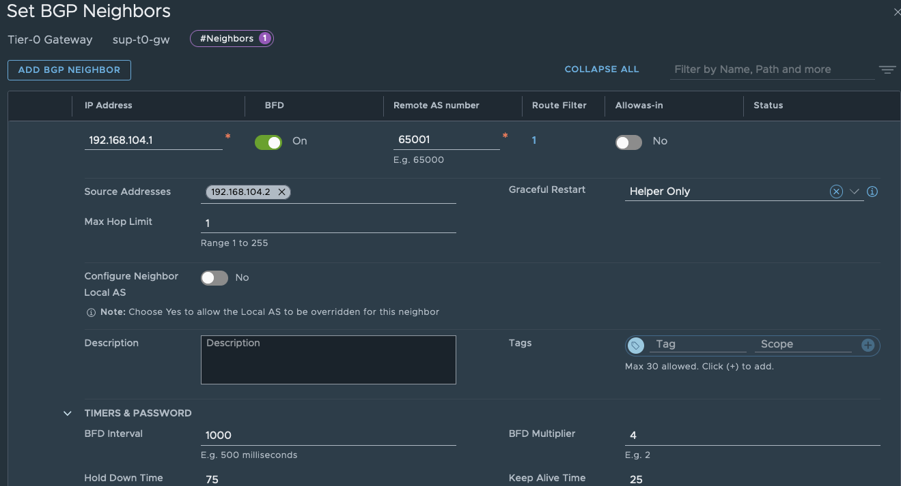

# Configuring BGP using BIRD on an Ubuntu Router. 

This leverages NSX as one of the peers deployed in a nested environment. The T0 will use one of the interfaces (vlan104 with IP address 192.168.104.1) as the default TOR switch.

## BIRD setup and config

### Install and configure BIRD
```shell
sudo apt-get -y install bird
sudo systemctl enable bird.service
sudo systemctl status bird.service
sudo journalctl -xeu bird.service
sudo cat /etc/bird/bird.conf # Modify the config as per the output below
```


```t
log syslog all;

router id 198.168.104.1; # Interface on the Ubuntu router to use to exchange route with the NSX T0

protocol kernel {
	scan time 60;
	import all;
	export all;   # insert routes into the kernel routing table
}

protocol device {
	scan time 60;
}

protocol direct {
}

protocol bgp {
  description "BIRD BGP CONFIG";
  local as 65001;
  neighbor 192.168.104.2 as 65003; # Interface on the NSX T0 router to use to exchange route with the Ubuntu router
  multihop;
  graceful restart;
  import all;
  export all;
  password "vmware";
}

protocol static {
  route 0.0.0.0/0 via 192.168.104.1; # Default route that NSX T0 will use. This disables the need to configure a static route on the T0
}
```

```shell
sudo systemctl restart bird.service
sudo journalctl -xeu bird.service
```

## NSX configuration and setup

Configurations that need to be done - 
1. Create a new IP Prefix list (`test-prefixlist` in the example). 
2. Add the Prefix list to the Route Maps. 
3. Enable BGP and add/configure the Ubuntu machine as the BGP neighbor. 
4. Set up Route Redistribution. 


### 1. Create a new IP Prefix list
Add the Namespace network(s) to the **Deny** list.  (I had issues using the system-provided IP Prefix list; hence had to create a new one)


### 2. Create a new Route Map


Add match criteria with the IP Prefix list created in step 1 as the member. 


### 3. Enable BGP

Enable BGP.


Add the Ubuntu as the BGP neighbor. Remember to set the password - "vmware" - as it was set in the Bird configuration above. 


Additionally, modify the Route Filter and add the Route Map created in Step 2 as an Out Filter. 


### 4. Setup Route Redistribution

Enable route redistribution using BGP.


See the example below of a sample route redistribution. Modify as per requirements. 


### Validation on the Ubuntu env

```shell
route
Kernel IP routing table
Destination     Gateway         Genmask         Flags Metric Ref    Use Iface
default         192.168.10.1    0.0.0.0         UG    0      0        0 ens34
172.16.0.1      192.168.104.2   255.255.255.255 UGH   0      0        0 vlan104 # From Ingress pool of Supervisor 
172.16.0.2      192.168.104.2   255.255.255.255 UGH   0      0        0 vlan104 # From Ingress pool of Supervisor
172.16.0.17     192.168.104.2   255.255.255.255 UGH   0      0        0 vlan104 # From Egress pool of Supervisor
172.16.10.0     192.168.104.2   255.255.255.0   UG    0      0        0 vlan104 # From a segment on a T1 connected to the T0
172.16.20.0     192.168.104.2   255.255.255.0   UG    0      0        0 vlan104 # From a segment on a T1 connected to the T0
192.168.10.0    0.0.0.0         255.255.255.0   U     0      0        0 ens34
192.168.100.0   0.0.0.0         255.255.254.0   U     0      0        0 ens37
192.168.102.0   0.0.0.0         255.255.254.0   U     0      0        0 vlan102
192.168.104.0   0.0.0.0         255.255.254.0   U     0      0        0 vlan104
```

```shell
sudo birdc
[sudo] password for nverma:
BIRD 1.6.8 ready.
bird>show route
0.0.0.0/0          via 192.168.104.1 on vlan104 [static1 22:24:57] ! (200)
192.168.100.0/23   dev ens37 [direct1 22:24:57] * (240)
192.168.102.0/23   dev vlan102 [direct1 22:24:57] * (240)
192.168.104.0/23   dev vlan104 [direct1 22:24:57] * (240)
                   via 192.168.104.2 on vlan104 [bgp1 22:25:14] (100/0) [AS65003?]
192.168.10.0/24    dev ens34 [direct1 22:24:57] * (240)
172.16.0.17/32     via 192.168.104.2 on vlan104 [bgp1 22:25:14] * (100/0) [AS65003?]
172.16.0.2/32      via 192.168.104.2 on vlan104 [bgp1 22:25:14] * (100/0) [AS65003?]
172.16.10.0/24     via 192.168.104.2 on vlan104 [bgp1 22:25:14] * (100/0) [AS65003?]
172.16.0.1/32      via 192.168.104.2 on vlan104 [bgp1 22:25:14] * (100/0) [AS65003?]
172.16.20.0/24     via 192.168.104.2 on vlan104 [bgp1 22:25:14] * (100/0) [AS65003?]

bird> show protocol all bgp1
name     proto    table    state  since       info
bgp1     BGP      master   up     22:24:57    Established
  Description:    BIRD BGP CONFIG
  Preference:     100
  Input filter:   ACCEPT
  Output filter:  ACCEPT
  Routes:         6 imported, 5 exported, 5 preferred
  Route change stats:     received   rejected   filtered    ignored   accepted
    Import updates:             24          0          0          6         18
    Import withdraws:           12          0        ---          0         12
    Export updates:             21         16          0        ---          5
    Export withdraws:           11        ---        ---        ---          0
  BGP state:          Established
    Neighbor address: 192.168.104.2
    Neighbor AS:      65003
    Neighbor ID:      192.168.104.2
    Neighbor caps:    refresh restart-aware AS4 add-path-rx
    Session:          external multihop AS4
    Source address:   192.168.104.1
    Hold timer:       53/75
    Keepalive timer:  3/25
```

### Validation on the T0 env

Login to the Edge node and set the context to the T0

```shell
ssh admin@192.168.100.71
admin@192.168.100.71's password:
....

Last login: Wed Dec  4 22:32:38 2024 from 192.168.100.1
NSX CLI (Edge 4.2.1.0.0.24304123). Press ? for command list or enter: help

edge-1> get logical-routers 

edge-1> vrf 1 # Change context to the SERVICE_ROUTER_TIER0

edge-1(tier0_sr[1])> get route

Flags: t0c - Tier0-Connected, t0s - Tier0-Static, b - BGP, o - OSPF
t0n - Tier0-NAT, t1s - Tier1-Static, t1c - Tier1-Connected,
t1n: Tier1-NAT, t1l: Tier1-LB VIP, t1ls: Tier1-LB SNAT,
t1d: Tier1-DNS FORWARDER, t1ipsec: Tier1-IPSec, isr: Inter-SR,
ivs: Inter-VRF-Static, > - selected route, * - FIB route

Total number of routes: 17

b  > * 0.0.0.0/0 [20/0] via 192.168.104.1, uplink-282, 01:24:22         # Default route from the Ubuntu router 
b  > * 192.168.10.0/24 [20/0] via 192.168.104.1, uplink-282, 01:24:22   # Route from the Ubuntu router
b  > * 192.168.100.0/23 [20/0] via 192.168.104.1, uplink-282, 01:24:22  # Route from the Ubuntu router
b  > * 192.168.102.0/23 [20/0] via 192.168.104.1, uplink-282, 01:24:22  # Route from the Ubuntu router
t1c> * 10.244.0.0/28 [3/0] via 100.64.0.3, downlink-310, 1d20h52m
t0c> * 100.64.0.0/31 is directly connected, downlink-292, 01w1d01h
t0c> * 100.64.0.2/31 is directly connected, downlink-310, 1d20h54m
t0c> * 169.254.0.0/24 is directly connected, backplane-286, 01:24:22
t1l> * 172.16.0.1/32 [3/0] via 100.64.0.3, downlink-310, 1d20h52m
t1l> * 172.16.0.2/32 [3/0] via 100.64.0.3, downlink-310, 1d20h47m
t1n> * 172.16.0.17/32 [3/0] via 100.64.0.3, downlink-310, 1d20h53m
t1c> * 172.16.10.0/24 [3/0] via 100.64.0.1, downlink-292, 1d21h50m
t1c> * 172.16.20.0/24 [3/0] via 100.64.0.1, downlink-292, 1d21h50m
t0c> * 192.168.104.0/23 is directly connected, uplink-282, 01w1d01h
t0c> * fc97:18ed:4b87:3400::/64 is directly connected, downlink-292, 01w1d01h
t0c> * fc97:18ed:4b87:5c00::/64 is directly connected, downlink-310, 1d20h54m
t0c> * fe80::/64 is directly connected, downlink-292, 01w1d01h


edge-1(tier0_sr[1])> get bgp neighbor summary
BFD States: NC - Not configured, DC - Disconnected
            DW - Down, IN - Init, UP - Up
BGP summary information for VRF default for address-family: ipv4Unicast
Router ID: 192.168.104.2  Local AS: 65003

Neighbor                            AS          State Up/DownTime  BFD InMsgs  OutMsgs InPfx  OutPfx

192.168.104.1                       65001       Estab 01:28:06     DW  28203   28002   5      6
```
